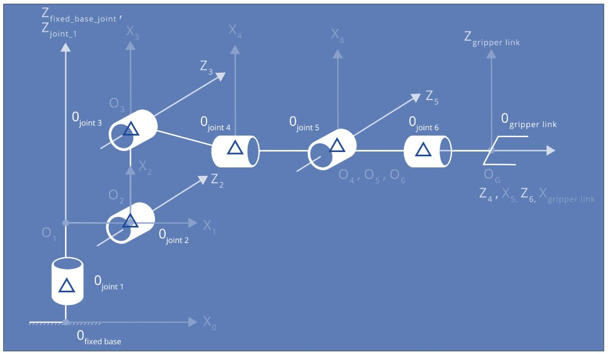
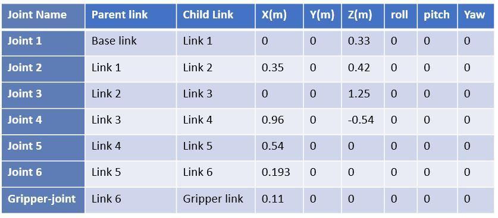
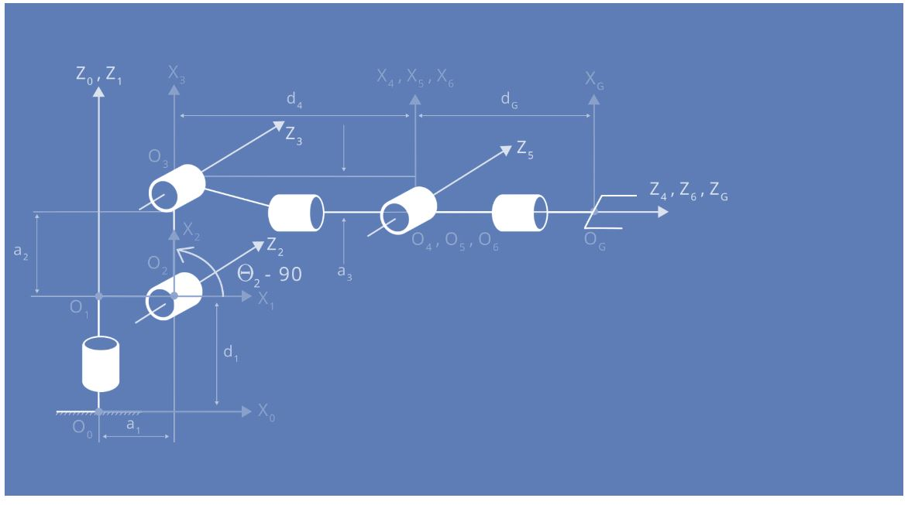
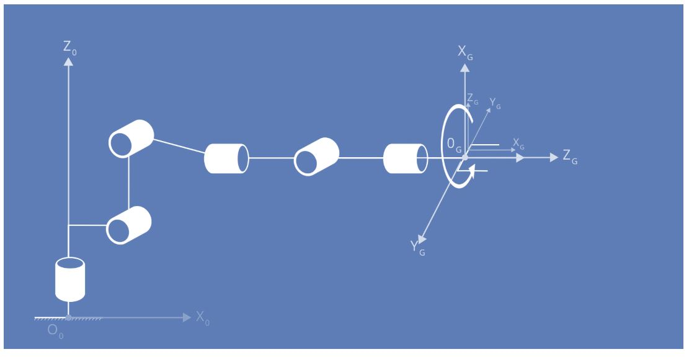

[//]: # (Image References)
[image_0]: ./misc_images/PickAndDrop.gif
# Robotic arm - Pick and Drop
![alt text][image_0] 

Make sure you are using robo-nd VM or have Ubuntu+ROS installed locally.

### One time Gazebo setup step:
Check the version of gazebo installed on your system using a terminal:
```sh
$ gazebo --version
```
To run projects from this repository you need version 7.7.0+
If your gazebo version is not 7.7.0+, perform the update as follows:
```sh
$ sudo sh -c 'echo "deb http://packages.osrfoundation.org/gazebo/ubuntu-stable `lsb_release -cs` main" > /etc/apt/sources.list.d/gazebo-stable.list'
$ wget http://packages.osrfoundation.org/gazebo.key -O - | sudo apt-key add -
$ sudo apt-get update
$ sudo apt-get install gazebo7
```

Once again check if the correct version was installed:
```sh
$ gazebo --version
```
### For the rest of this setup, catkin_ws is the name of active ROS Workspace, if your workspace name is different, change the commands accordingly

If you do not have an active ROS workspace, you can create one by:
```sh
$ mkdir -p ~/catkin_ws/src
$ cd ~/catkin_ws/
$ catkin_make
```

Now that you have a workspace, clone or download this repo into the **src** directory of your workspace:
```sh
$ cd ~/catkin_ws/src
$ git clone https://github.com/udacity/RoboND-Kinematics-Project.git
```

Now from a terminal window:

```sh
$ cd ~/catkin_ws
$ rosdep install --from-paths src --ignore-src --rosdistro=kinetic -y
$ cd ~/catkin_ws/src/RoboND-Kinematics-Project/kuka_arm/scripts
$ sudo chmod +x target_spawn.py
$ sudo chmod +x IK_server.py
$ sudo chmod +x safe_spawner.sh
```
Build the project:
```sh
$ cd ~/catkin_ws
$ catkin_make
```

Add following to your .bashrc file
```
export GAZEBO_MODEL_PATH=~/catkin_ws/src/RoboND-Kinematics-Project/kuka_arm/models

source ~/catkin_ws/devel/setup.bash
```

For demo mode make sure the **demo** flag is set to _"true"_ in `inverse_kinematics.launch` file under /RoboND-Kinematics-Project/kuka_arm/launch

In addition, you can also control the spawn location of the target object in the shelf. To do this, modify the **spawn_location** argument in `target_description.launch` file under /RoboND-Kinematics-Project/kuka_arm/launch. 0-9 are valid values for spawn_location with 0 being random mode.

You can launch the project by
```sh
$ cd ~/catkin_ws/src/RoboND-Kinematics-Project/kuka_arm/scripts
$ ./safe_spawner.sh
```

If you are running in demo mode, this is all you need. To run your own Inverse Kinematics code change the **demo** flag 
described above to _"false"_ and run your code (once the project has successfully loaded) by:
```sh
$ cd ~/catkin_ws/src/RoboND-Kinematics-Project/kuka_arm/scripts
$ rosrun kuka_arm IK_server.py
```
Once Gazebo and rviz are up and running, make sure you see following in the gazebo world:

	- Robot
	
	- Shelf
	
	- Blue cylindrical target in one of the shelves
	
	- Dropbox right next to the robot
	

If any of these items are missing, report as an issue.

Once all these items are confirmed, open rviz window, hit Next button.

To view the complete demo keep hitting Next after previous action is completed successfully. 

Since debugging is enabled, you should be able to see diagnostic output on various terminals that have popped up.

The demo ends when the robot arm reaches at the top of the drop location. 

There is no loopback implemented yet, so you need to close all the terminal windows in order to restart.

In case the demo fails, close all three terminal windows and rerun the script.

# DH Parameters Kinematics Analysis
## Joint Reference Frame Origins
The joint reference frame origins are indicated by the blue triangle in orientations  as they  appear in the URDF file.
One thing that we need to understand about the URDF file is that each joint is defined relatively to its parent.
Meaning to get from joint 2, we have to 'translate' .35 meters in the 'X' direction and .42 meters in the Z direction.



## Reference frame  assignesments in URDF file
Each row of the DH parameter table represents the homogeneous transform between frame {i-1} and frame {i}.Therefore we 
should incrementally check that the position of our frame origins are consistent with the cumulative displacements 
defined in the URDF file.

##### Relative location of joint {i-1} to joint {i}


Since the Robot arm has 6 revolute joints, only the &theta; terms are time variable. The only  complicated one is joint2.
 &theta;i is the angle between xi-1 and xi measured about the zi axis in a right hand sense. The Robot arm is shown where
 all the joint angles are assumed to be 0.Therefore, x1 is not parallel to x2 when &theta;2 equals 0.There's a constant
  offset of -90 degrees


## Comparing the total Homogeneous transform between the base link and the Gripper Link
To compare the total homogeneous transform between the base link and the gripper link, one need to account for the 
difference in orientation of the gripper link frame. To do this is to apply a sequence of  fix body that is intrinsic
rotations to the gripper frame in the python code. To do so is to align the two frames, first rotate about the z axis
by 180 degrees and then the y axis by  -90 degrees.

### Rotate the gripper reference frame  about the z axis by 180 degrees


### Rotate the gripper reference frame about the z axis by -90 degrees


